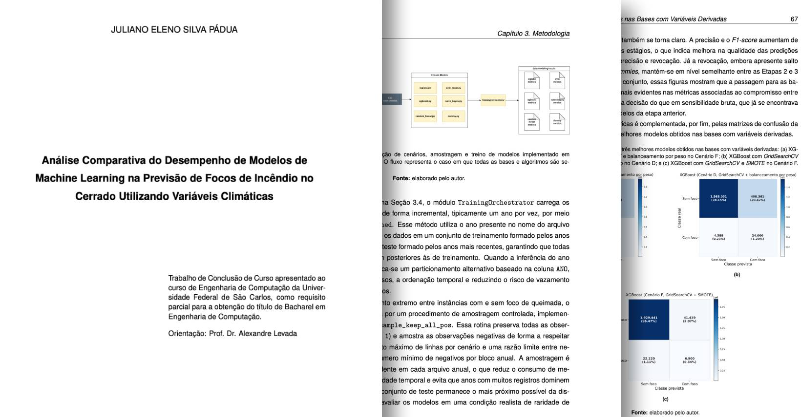

  
   
  Fonte: arquivo pessoal

# Seja bem-vindo!

Olá, sou o Juliano, mas pode me chamar de Pádua. Sou graduando em Engenharia de Computação na UFSCar. Trabalho no mercado com análise de fraude. Também atuo com pesquisa, onde meu enfoque é no desempenho de modelos de _ensemble_ na detecção de focos de incêndios.

---

## Projetos de Pesquisa e Desenvolvimento

O **Forest Portal** é um projeto _open-source_ que aplica infraestrutura de dados abertos integrando fontes públicas. Construído com Next.js e TypeScipt de um lado, Python e Supabase de outro, o projeto almeja centralizar indicadores ambientais, financeiros, sociais, etc., para análise pública. Você pode acompanhar meu progresso em:
- [Repositório do Forest Portal - Frontend da aplicação](https://github.com/julianopadua/forest-portal)
- [Repositório do Forest Open Data Pipeline](https://github.com/julianopadua/forest-open-data-pipelines)

  

Já no âmbito acadêmico, decidi realizar a pesquisa do meu **Trabalho de Conclusão de Curso** centrada no desempenho comparativo de modelos de Machine Learning (XGBoost, Random Forest, entre outros) para previsão da ocorrência de focos de incêndios (e de queimadas) no bioma Cerrado. O fluxo de trabalho é centrado em Python, com aplicação incremental de meus conhecimentos em Ciência de Dados. Mesmo após defender a monografia, minha pesquisa continua e o objetivo agora é aplicar Fusão Temporal e adicionar a feature de NDVI. Você pode acompanhar minha pesquisa em:
- [Repositório do meu TCC](https://github.com/julianopadua/tcc)

  
   
  Fonte: <a href="https://repositorio.ufscar.br/items/969fd627-d894-40be-89fb-b20127ba3f03">Repositório UFSCar</a>

---

## Contato

- GitHub: [julianopadua](https://github.com/julianopadua)
- E-mail: julianofpadua@gmail.com
